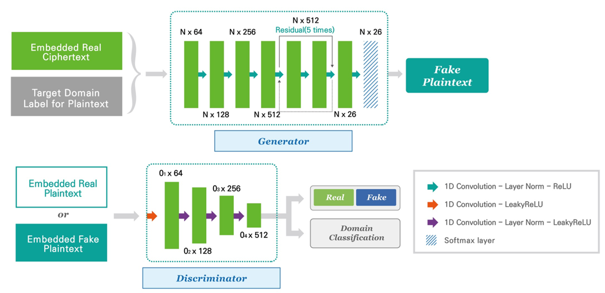

# UMC-GAN inspired by: Automated Classical Cipher Emulation Attacks via Unified Unsupervised Generative Adversarial Networks

\
plain-to-multi-ciphers domain or  multi-ciphers-to-single-plain domain

\
\
Torch implementation for learning a mapping between Plain text to Cipher Text


\
\


## Setup

### Prerequisites

- Linux or OSX
- NVIDIA GPU + cpu CuDNN (CPU mode and cpu without CuDNN may work with minimal modification, but untested)

### Getting Started

- Clone this repo:

```bash
git clone git@github.com:tdn02007/UC-GAN-Unified-cipher-generative-adversarial-network.git
cd UC-GAN-Unified-cipher-generative-adversarial-network
```

### Lib

The code to make substitution cipher text.

- caeser.py: Caeser
- substitution.py: Substitution
- vigenere.py: Vigenere
- cipher.py: Encryption Test code

The code to make transposition cipher text.
Plaintexts can be rearranged into a ciphertext using a key, scrambling the order of characters like the shuffled pieces of a jigsaw puzzle. The resulting message is hard to decipher without the key because there are many ways the characters can be arranged. [wiki]


### data

Only samples have been uploaded to test the code above.

Structure for substitution ciphers:

- data
  - train
    - 0.plain
    - 1.caeser
    - 2.vigenere
    - 3.substitution
  - test
    - 0.plain
    - 1.caeser
    - 2.vigenere
    - 3.substitution


Structure for rotor ciphers:

- data
  - train
    - 0.plain
    - 1.enigma
    - 2.enigma M4
    - 3.typex
  - test
    - 0.plain
    - 1.enigma
    - 2.enigma M4
    - 3.typex


## Train

Example of use of UMC-GAN cryptanalysis model with substitution ciphers
```bash
python main.py --solver_type substitution
```
Example of use of UMC-GAN cryptanalysis model with transposition ciphers
```bash
python main.py --solver_type transposition
```
Example of use of UMC-GAN cryptanalysis model with rotor ciphers
```bash
python main.py --solver_type rotor_enigma_typex
```
